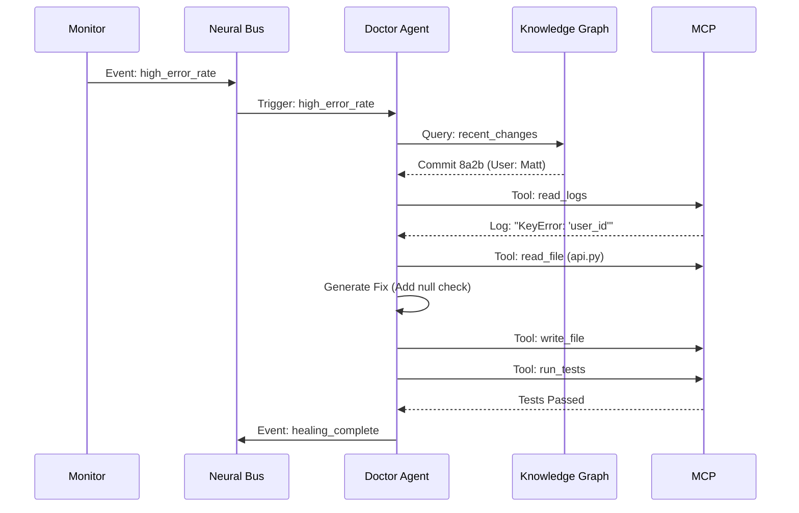

# BrainOps AI Operating System V2: The Cognitive Evolution

**Status:** DRAFT
**Date:** December 10, 2025
**Author:** Gemini 3.0 Pro (acting CTO)
**Target:** Weathercraft ERP, MyRoofGenius, BrainOps Infrastructure

---

## 1. Executive Summary: From "System" to "Organism"

The current BrainOps architecture (V1) is a robust collection of integrated components—a "system of systems." V2 represents a paradigm shift to a **Cognitive Organism**.

**Key Shifts:**
*   **Communication:** From HTTP/REST (Hub-and-Spoke) → **Async Message Mesh (Neural Bus)**.
*   **State:** From Polling/Sync → **Event Sourcing (The Stream)**.
*   **Healing:** From Rule-Based Recovery → **Predictive Immunology**.
*   **Improvement:** From Human-Triggered Refactoring → **Autonomous Evolutionary Loops**.

---

## 2. Core Architecture: The "BrainOps Trinity"

The V2 architecture is built on three pillars:

### A. The Neural Bus (Communication & Events)
Instead of direct point-to-point API calls, all components connect to a central, high-performance message bus (Redis Streams or NATS JetStream).
*   **Pattern:** Pub/Sub + Stream Processing.
*   **Protocol:** CloudEvents (JSON) for interoperability.
*   **Benefit:** Decouples agents. A "Code Quality Agent" doesn't need to know *who* wrote the code, just that a `git.commit.created` event occurred.

### B. The Knowledge Graph (Memory & Context)
The `Codebase Graph` and `Database Schema` are merged into a unified **Semantic Knowledge Graph**.
*   **Storage:** PostgreSQL (pgvector) + Neo4j (optional for complex relations).
*   **Content:** Code, Runtime State, Business Metrics, and Agent Memories.
*   **Benefit:** Agents understand *impact*. Changing a function in `utils.py` allows the agent to query the graph and see exactly which 14 API endpoints will be affected.

### C. The MCP Swarm (Action & Interaction)
The `MCP Bridge` becomes the standard interface for *all* actions.
*   **Uniformity:** Whether restarting a server, writing a file, or sending an email, it's an MCP Tool Call.
*   **Security:** Fine-grained permission scopes (e.g., "Agent X can only read files in /src").
*   **Scale:** Serverless deployment of tool executors.

---

## 3. Detailed Design

### 3.1 Agent Communication Protocol
Agents no longer "call" each other. They "signal" intentions and "listen" for needs.

**Protocol: `BrainOps-ACP` (Agent Communication Protocol)**
```json
{
  "id": "evt_12345",
  "type": "agent.intent.code_fix",
  "source": "agent:diagnosis:v2",
  "payload": {
    "target_file": "src/api/routes.ts",
    "issue": "High latency detected",
    "confidence": 0.95
  },
  "context": {
    "trace_id": "trace_abc",
    "priority": "high"
  }
}
```

### 3.2 Event-Driven Architecture (The "Nervous System")
All state changes emit events.
*   **Stimulus:** `deployment.failed`
*   **Reaction:**
    1.  `DevOps Agent` receives event.
    2.  Queries `Knowledge Graph` for recent commits.
    3.  Identifies culprit commit `abc1234`.
    4.  Emits `agent.command.rollback`.
    5.  Emits `agent.task.analyze_root_cause`.

### 3.3 True Self-Healing (The "Immune System")
Moving beyond simple retries (`self_healing_recovery.py`) to active remediation.

**Workflow:**
1.  **Detection:** `Monitor` detects 500 Error rate > 1%.
2.  **Diagnosis:** `Investigator Agent` pulls logs via MCP, correlates with `Codebase Graph` to find the modified SQL query.
3.  **Prescription:** Agent drafts a fix (e.g., adds missing index).
4.  **Validation:** `Tester Agent` runs unit tests in a sandbox.
5.  **Treatment:** Fix is applied via MCP `write_file` and deployed.

### 3.4 Autonomous Revenue (The "Hunter-Gatherer" Swarm)
A coordinated swarm operating on the Neural Bus.
*   **Scout:** Scans social/web for leads -> Emits `lead.discovered`.
*   **Analyst:** Enriches lead data -> Emits `lead.qualified`.
*   **Strategist:** Generates personalized angle -> Emits `outreach.ready`.
*   **Diplomat:** Sends email/DM via MCP -> Emits `outreach.sent`.
*   **Closer:** Monitors replies, schedules demos.

### 3.5 Self-Improving Code (The "Evolutionary Engine")
The most ambitious pillar.
1.  **Crawler:** `codebase_graph_crawler.py` runs nightly.
2.  **Analyst:** `CodeQualityAgent` (now fully implemented) scans the Graph for anti-patterns (e.g., circular dependencies, massive functions).
3.  **Architect:** Proposes a refactor plan.
4.  **Coder:** Implements changes in a separate branch.
5.  **Reviewer:** specialized LLM reviews the PR.
6.  **Merge:** If tests pass + review passes, code evolves.

---

## 4. System Diagrams

### 4.1 High-Level Topology
```mermaid
graph TD
    subgraph "External World"
        Users
        Webhooks
        APIs
    end

    subgraph "The Neural Bus (Event Mesh)"
        Stream[Redis Stream / NATS]
    end

    subgraph "The Cortex (Intelligence)"
        Orchestrator[Orchestrator Agent]
        Planner[Planner Agent]
        Reviewer[Reviewer Agent]
    end

    subgraph "The Effectors (MCP)"
        Tools[MCP Server]
        FileSys[File System]
        DB[Database]
        Cloud[Render/Vercel]
    end

    subgraph "Memory"
        Graph[Codebase Graph]
        Vector[Vector DB]
        SQL[Relational DB]
    end

    External World -->|Events| Stream
    Stream <--> Cortex
    Cortex -->|Tool Calls| Tools
    Tools --> FileSys
    Tools --> Cloud
    Cortex <--> Memory
    Tools <--> Memory
```

### 4.2 Self-Healing Data Flow


---

## 5. Security & Scalability

### Security: "Zero Trust Agents"
*   **Sandboxing:** Agents execute code changes in isolated Docker containers (BrainOps Sandbox).
*   **Audit Trail:** Every MCP call is logged to an immutable ledger.
*   **Human-in-the-Loop:** Critical actions (Deploy to Prod, Delete Data) require a `approval.required` event handled by a human admin interface.

### Scalability
*   **Stateless Agents:** Agents store no local state; they read/write to the Graph/DB.
*   **Horizontal Scaling:** Spin up 50 "Reviewer Agents" during heavy development cycles.
*   **Provider Agnostic:** `ai_core.py` (ModelRouter) dynamically routes to OpenAI/Anthropic/Gemini based on load and cost.

---

## 6. Implementation Plan

### Phase 1: The Nervous System (Weeks 1-2)
*   Deploy Redis/NATS.
*   Refactor `realtime_state_sync.py` to use the message bus.
*   Standardize CloudEvents format.

### Phase 2: The Graph (Weeks 3-4)
*   Enhance `codebase_graph_crawler.py` to parse full dependency trees.
*   Integrate Graph with `Orchestrator` for context-aware decisions.

### Phase 3: The Immune System (Weeks 5-6)
*   Implement `Doctor Agent`.
*   Connect `monitor_deployment.py` to the Event Bus.
*   Enable autonomous rollbacks.

### Phase 4: Evolution (Weeks 7-8)
*   Activate `CodeQualityAgent` with write permissions.
*   Start with "safe" refactors (unused imports, formatting).
*   Graduate to logic optimization.

---

**BrainOps V2 is not just software. It is a digital employee that never sleeps, constantly learns, and perpetually improves.**
